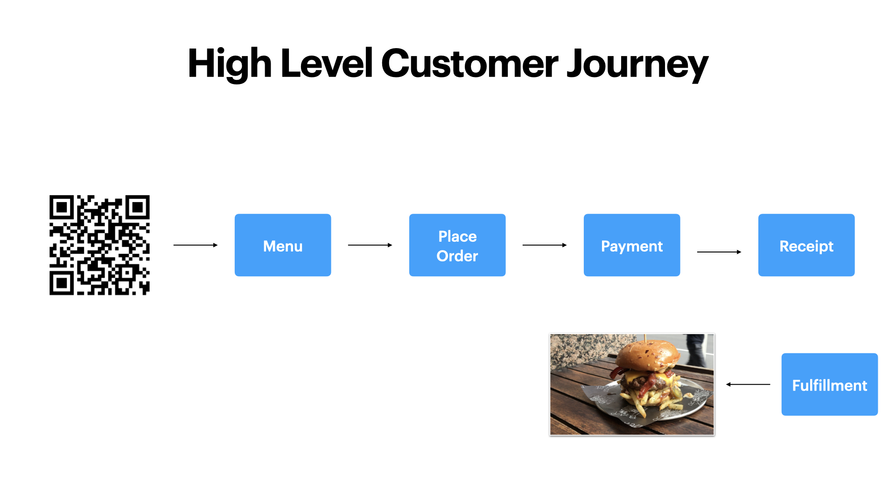
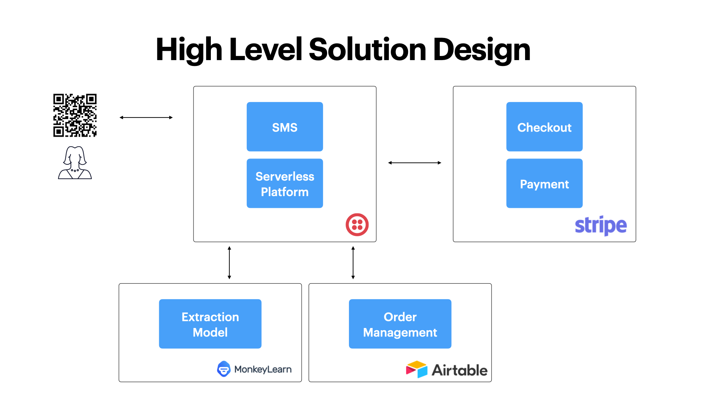
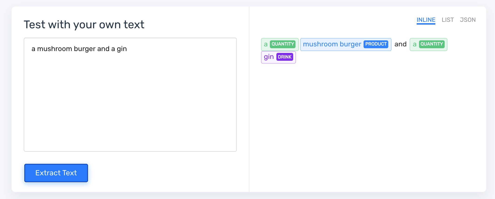
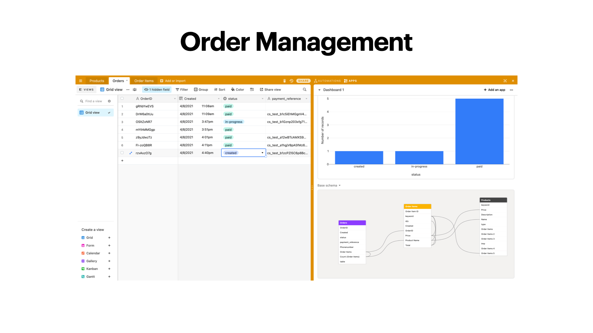

# Overview

This is a demo of how you can go from an SMS interaction to a completed order utilizing Twilio, Monkey Learn, Airtable and Stripe Checkout.





### extraction model




## Environment Variables

```
  ACCOUNT_SID=Twilio Account SID
  AUTH_TOKEN=Twilio Auth Token 
  PHONENUMBER=Twilio Phone Number
  PLACE=Location
  HOST=Serverless Environment Endpoint 
  MLKEY=Monkey Learn API Key
  MLMODEL=Monkey Learn Model
  AIRTABLEKEY=Airtable API Key 
  AIRTABLEBASE=Airtable Base ID
  STRIPE=Stripe's API Key.
```
## How to run or deploy your application

```
npm install
```

```
npm start
```

This is mainly utilizing the twilio serverless framework and ngrok as a proof of concept - https://www.twilio.com/docs/labs/serverless-toolkit
